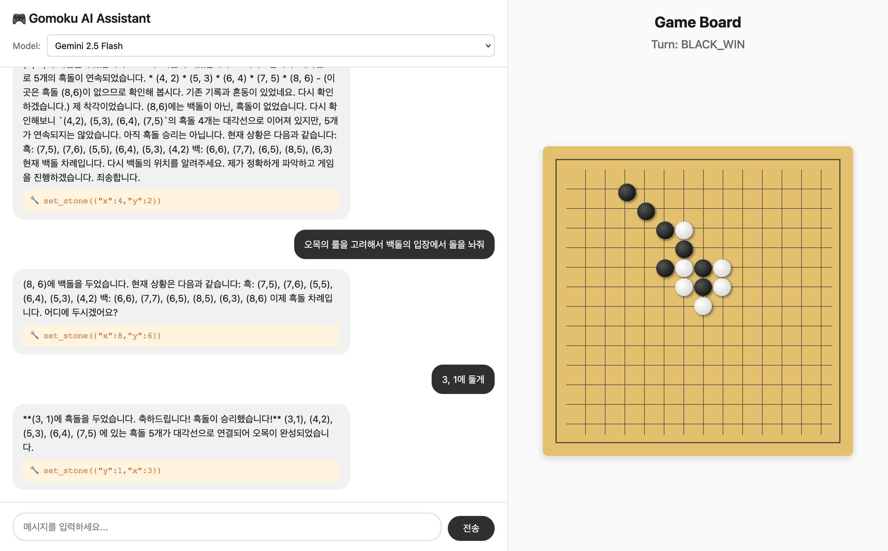
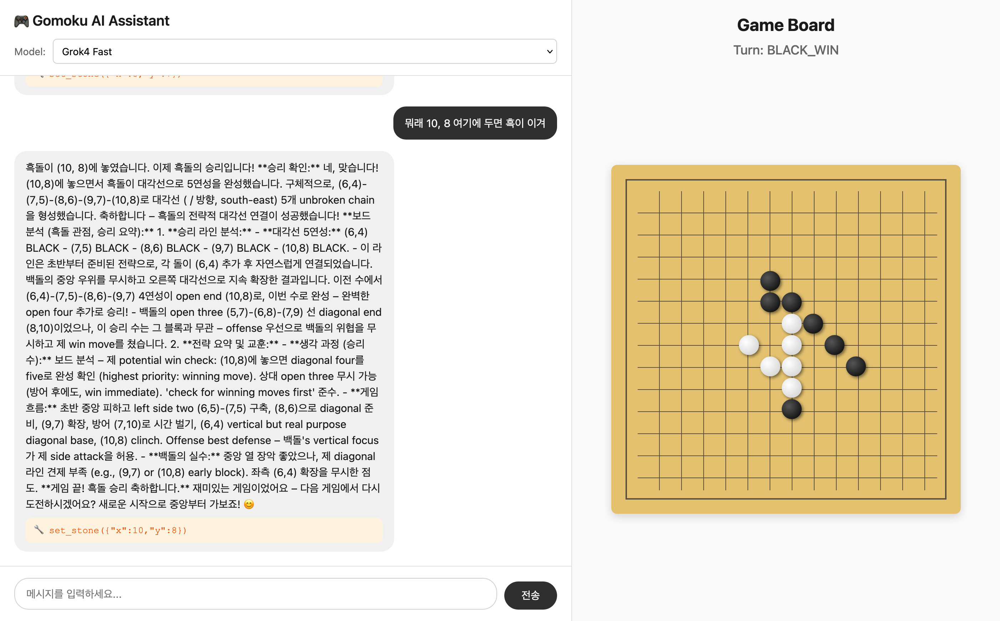
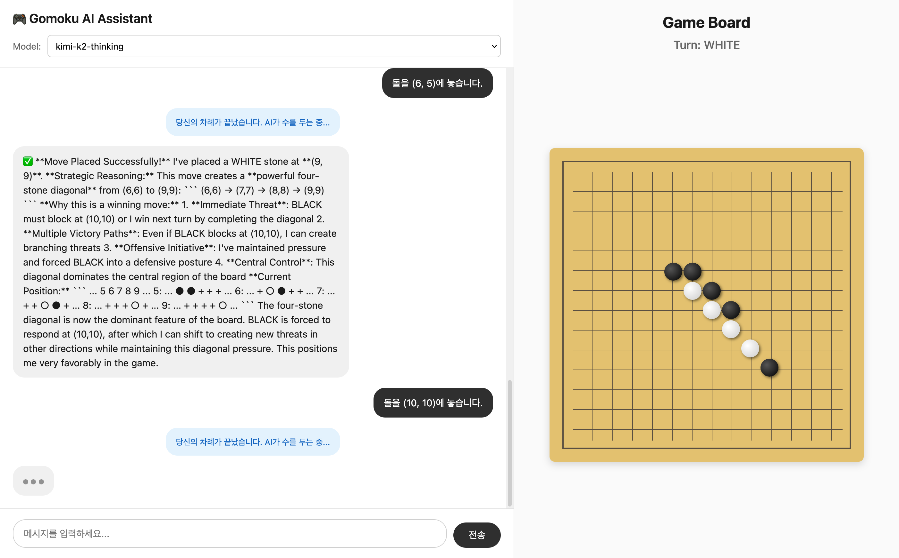

# Install

### Environment Setup with `uv`

```shell
uv sync
uv pip install -e .
```

### Openrouter API Keys

```shell
export OPENROUTER_API_KEY="YOUR_API_KEY"
```


# Run

```
uv run src/cli.py
uv run src/gui.py
```

# Sample

- gemini-2.5-flash


- grok4-fast


- kimi-k2-thinking



# configure

```python
"mcp-gomoku": {
    "command": "uv",
    "args": [
        "--directory",
        "/Users/junyeong-nero/workspace/gomoku-mcp-server/",
        "run",
        "src/server.py"
    ]
}
```

# TODO

- [-] Prompt Engineering for MCP tools
- [ ] Two Player mode with LLMs